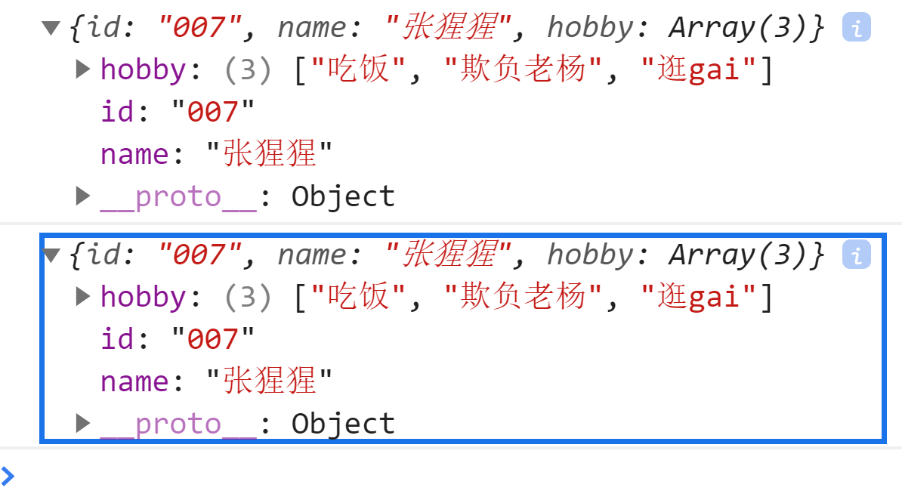
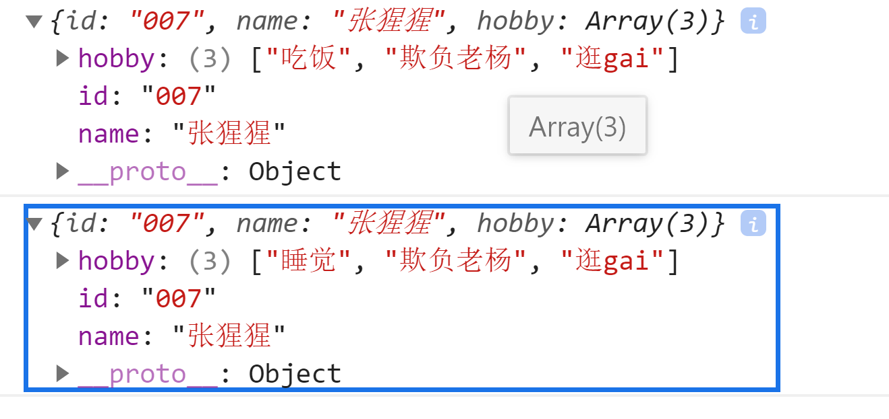
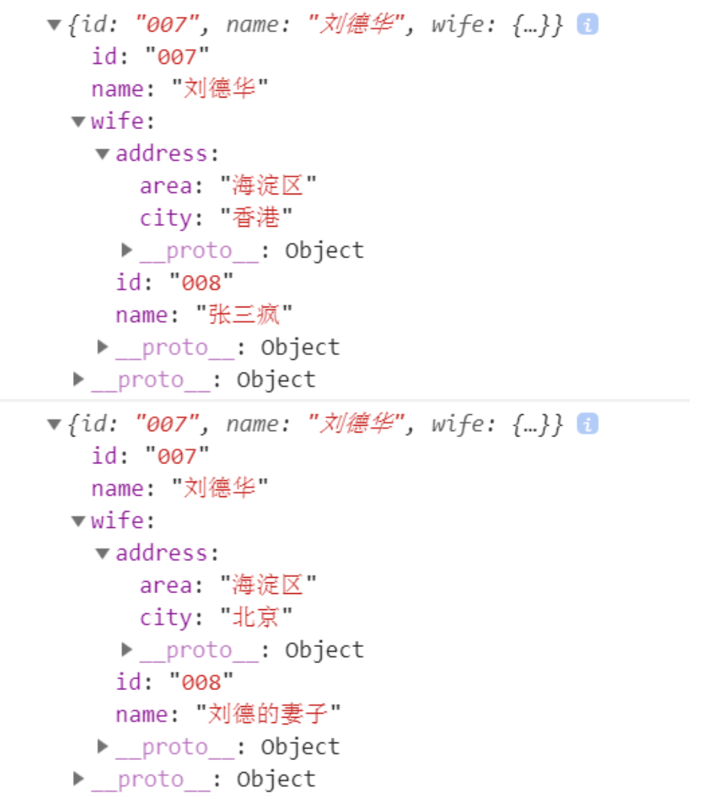
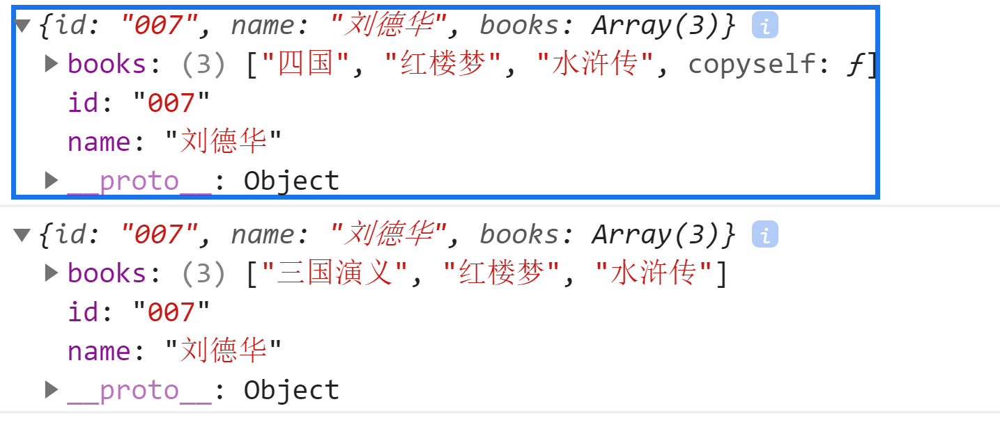

# 深拷贝和浅拷贝

[前端面试题系列9」浅拷贝与深拷贝的含义、区别及实现](https://segmentfault.com/a/1190000018879536)

浅拷贝：只拷贝第一层的原始类型值，和第一层的引用类型地址

深拷贝：拷贝所有的属性值，以及属性地址指向的值的内存空间(当遇到对象时，就再新开一个对象，然后将第二层源对象的属性值，完整地拷贝到这个新开的对象中)

## 定义一个 json 对象

```json
var p = {
        "id":"007",
        "name":"张猩猩",
        "hobby":new Array("睡觉","欺负老杨","逛gai")  //这是引用类型
    }
```

## **把该对象p进行复制一份**

### 1、浅拷贝

```javascript
var p2 = {};
for(let key in p){
	p2[key] = p[key];	
}
p2.books[0] ="吃饭";
console.log(p2);
console.log(p);
```



### 2、**深拷贝（初步）**

```javascript

var p2 = {};
for(let key in p){
	if(typeof p[key]=='object'){
		p2[key]=[];//因为 上面写的是数组,所以,暂时赋值一个空数组.
		for(let i in p[key]){
			p2[key][i] = p[key][i]
		}
	}else{
		p2[key] = p[key];
	}
}
p2.hobby[0] ="吃饭";
console.log(p2);
console.log(p);
```



### **3、深拷贝（最终）**

#### 3.1**深拷贝_如果属性都是json对象，那么用递归的方式**

//如果对象的属性是对象(引用类型),属性的属性也是引用类型,即层层嵌套很多.怎么办,只能递归

//如下对象,要复制:

```javascript
var p = {
	"id":"007",
	"name":"刘德华",
	"wife":{
		"id":"008",
		"name":"刘德的妻子",
		"address":{
			"city":"北京",
			"area":"海淀区"
		}
	}
}
 
//写函数
function copyObj(obj){
	let newObj={};
	for(let key in obj){
		if(typeof obj[key] =='object'){//如:key是wife,引用类型,那就递归
			newObj[key] = copyObj(obj[key])
		}else{//基本类型,直接赋值
			newObj[key] = obj[key];
		}
	}
	return newObj;
}
 
let pNew = copyObj(p);
pNew.wife.name="张三疯";
pNew.wife.address.city = "香港";
console.log(pNew);
console.log(p);
```



#### **3.2、深拷贝_如果属性是数组等非键值对的对象**

就得单独处理：要么给数组增加一个自我复制的函数（建议这样做），要么单独判断。

```javascript
//给数组对象增加一个方法，用来复制自己
Array.prototype.copyself = function(){
	let arr = new Array();
	for(let i in this){
		arr[i]  = this[i]
	}
	return arr;
}
 
var p = {
	"id":"007",
	"name":"刘德华",
	"books":new Array("三国演义","红楼梦","水浒传")//这是引用类型
}
 
function copyObj(obj){
	let newObj={};
	for(let key in obj){
		if(typeof obj[key] =='object'){//如:key是wife,引用类型,那就递归
			newObj[key] = obj[key].copyself();
		}else{//基本类型,直接赋值
			newObj[key] = obj[key];
		}
	}
	return newObj;
}
 
var pNew = copyObj(p);
pNew.books[0] = "四国";
console.log(pNew);
console.log(p); 
```



